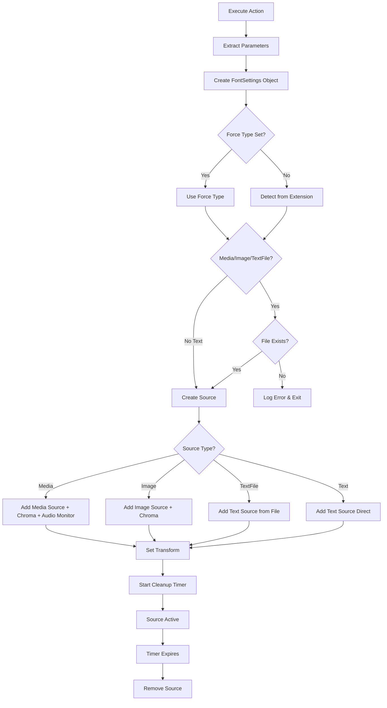

# Streamer.bot Temporary MediaSource Population

A comprehensive Streamer.bot C# action that creates temporary sources in OBS Studio with intelligent type detection, automatic filtering, and cleanup. Supports multiple source types including media files, images, text, and text files. Perfect for overlay effects, alerts, notifications, or any temporary content that needs to appear for a specific duration.

## Features

- ✨ **Multi-Source Support**: Media files (video/audio), images, text content, and text files
- 🧠 **Intelligent Detection**: Automatically determines source type from file extensions
- 🎨 **Chroma Key Support**: Built-in chroma key filtering with customizable settings
- 📝 **Advanced Text Sources**: Modern text_gdiplus_v3 with full font customization
- ⏰ **Timed Cleanup**: Automatically removes sources after a specified duration
- 📐 **Flexible Positioning**: Customizable size and position for each source
- 🔊 **Smart Audio Monitoring**: Configurable audio output for media sources only
- 🔧 **Parameter Driven**: Highly configurable through Streamer.bot arguments
- 🎯 **Conflict Prevention**: Uses GUID-based naming to avoid source name conflicts
- 📝 **Comprehensive Logging**: Built-in logging for debugging and monitoring
- 🏗️ **Clean Architecture**: Well-structured code using FontSettings class and enum-based dispatching

## Requirements

### Software Dependencies
- **Streamer.bot** (Latest version recommended)
- **OBS Studio** with WebSocket plugin enabled
- **.NET Framework** (Streamer.bot compatible version)

### NuGet Packages
- `Newtonsoft.Json` - For JSON parsing and manipulation

## Installation

### Quick Setup (Simple)

1. Copy the C# code from `Execute C#` file
2. Create a new C# action in Streamer.bot
3. Paste the code into the action editor
4. Ensure Newtonsoft.Json is available in your Streamer.bot environment
5. Configure the action arguments (see Parameters section below)

### Full Setup (Recommended)

This method provides better organization and reusability by separating the code logic from parameter configuration.

#### Step 1: Create the Core C# Function

1. **Create New Action**
   - Right-click in Actions tab → "Add Action"
   - Name: `TempMediaSource_Core`
   - Trigger: **None** (No Trigger)

2. **Add C# Code Sub-Action**
   - Add Sub-Action → "Core" → "C#" → "Execute C# Code"
   - Paste the complete C# code from `Execute C#` file
   - **Important**: In Code Editor Settings, set **Name** field to: `TempMediaSourceFunction`
   - Click "Compile" to ensure no errors

#### Step 2: Create Parameter Configuration Actions

Create individual actions for each media type you want to use. Repeat this step for each different media source:

1. **Create Media-Specific Action**
   - Right-click in Actions tab → "Add Action"
   - Name: `TempMedia_FollowAlert` (or your preferred name)
   - Trigger: **None** (No Trigger)

2. **Configure Parameters**
   - Add Sub-Action → "Core" → "Variables" → "Set Argument"
   - Set each parameter (repeat for all needed parameters):
     ```
     BlinkVidPath: "D:\Alerts\follow-alert.mp4"
     BlinkTaskLength: 3
     BlinkWidth: 400
     BlinkHeight: 200
     BlinkPosX: 960
     BlinkPosY: 100
     BlinkChroma: 0x00FF00
     BlinkChromaSim: 400
     BlinkChromaSmooth: 80
     BlinkAudioMonitor: true
     ```

3. **Add Execute Code Sub-Action**
   - Add Sub-Action → "Core" → "C#" → "Execute C# Method"
   - In the dropdown, select: `TempMediaSourceFunction` (the named function from Step 1)
   - This should be the **last** sub-action in the list

4. **Repeat for Multiple Media Types**
   - `TempMedia_SubAlert`
   - `TempMedia_DonationAlert`
   - `TempMedia_HostAlert`
   - etc.

#### Step 3: Create Trigger Actions

Create the actions that will actually be triggered by events:

1. **Create Triggered Action**
   - Right-click in Actions tab → "Add Action"
   - Name: `OnFollow` (or your event name)
   - Trigger: **Set your desired trigger** (e.g., Twitch Follow, Channel Point Reward, etc.)

2. **Add Run Action Sub-Action**
   - Add Sub-Action → "Core" → "Actions" → "Run Action"
   - Select Action: `TempMedia_FollowAlert` (the parameter action from Step 2)

3. **Repeat for All Events**
   - Create `OnSubscription` → Run `TempMedia_SubAlert`
   - Create `OnDonation` → Run `TempMedia_DonationAlert`
   - Create `OnHost` → Run `TempMedia_HostAlert`
   - etc.

#### Benefits of Full Setup

- **Reusability**: One core function, multiple configurations
- **Organization**: Clear separation of logic and parameters
- **Maintainability**: Update code in one place, affects all media sources
- **Flexibility**: Easy to add new media types without duplicating code
- **Testing**: Can test individual parameter sets without triggers

## Supported Source Types

The system automatically detects source types based on file extensions:

| Source Type | Extensions | Description |
|-------------|------------|-------------|
| **Media** | `.mp4`, `.avi`, `.mov`, `.mkv`, `.wmv`, `.flv`, `.webm`, `.m4v`, `.3gp`, `.mpg`, `.mpeg` | Video and audio files using ffmpeg_source |
| **Image** | `.jpg`, `.jpeg`, `.png`, `.gif`, `.bmp`, `.tiff`, `.tga`, `.webp` | Static images using image_source |
| **Text File** | `.txt`, `.rtf`, `.log`, `.md`, `.json`, `.xml`, `.csv` | Text content loaded from file using text_gdiplus_v3 |
| **Text** | N/A | Direct text content using text_gdiplus_v3 |

### Force Type Override (Optional)

**Automatic detection works for 99% of use cases.** You only need `BlinkForceType` for special situations:

- `Media` - Force media source (ffmpeg_source) for unusual file extensions
- `Image` - Force image source (image_source) for custom image formats  
- `TextFile` - Force text from file (text_gdiplus_v3) when path should be read as file
- `Text` - Force direct text content (text_gdiplus_v3) when content looks like a file path

**When to use:** Unusual file extensions, treating file paths as literal text, or custom formats.

## Parameters

Configure these arguments in your Streamer.bot action:

### Core Parameters
| Parameter | Type | Default | Description |
|-----------|------|---------|-------------|
| `BlinkVidPath` | String | `""` | **Required** - File path or text content |
| `BlinkTaskLength` | Integer | `10` | Duration in seconds before auto-removal |
| `BlinkForceType` | String | `""` | **Optional** - Override automatic type detection (rarely needed) |
| `BlinkWidth` | Integer | `640` | Source width in pixels |
| `BlinkHeight` | Integer | `360` | Source height in pixels |
| `BlinkPosX` | Integer | `100` | X position on screen |
| `BlinkPosY` | Integer | `100` | Y position on screen |

### Media/Image Parameters
| Parameter | Type | Default | Description |
|-----------|------|---------|-------------|
| `BlinkChroma` | Integer/Hex | `0x00FF00` | Chroma key color (supports hex format) |
| `BlinkChromaSim` | Integer | `400` | Chroma key similarity threshold |
| `BlinkChromaSmooth` | Integer | `80` | Chroma key smoothness value |
| `BlinkAudioMonitor` | Boolean | `false` | Enable audio monitoring (media only) |

### Text Parameters
| Parameter | Type | Default | Description |
|-----------|------|---------|-------------|
| `BlinkFontFamily` | String | `"Arial"` | Font family name |
| `BlinkFontSize` | Integer | `48` | Font size in points |
| `BlinkTextColor` | Integer/Hex | `0xFFFFFF` | Text color (white) |
| `BlinkFontStyle` | String | `""` | Font style (Bold, Italic, etc.) |
| `BlinkBgColor` | Integer/Hex | `0x000000` | Background color (black) |
| `BlinkBgOpacity` | Integer | `0` | Background opacity (0-100) |
| `BlinkEnableBg` | Boolean | `false` | Enable background rendering |

### Parameter Examples

#### Media File (Auto-detected)
```
BlinkVidPath: "D:\Videos\alert.mp4"
BlinkTaskLength: 5
BlinkChroma: 0x00FF00  (or 65280 for green)
BlinkWidth: 1920
BlinkHeight: 1080
BlinkPosX: 0
BlinkPosY: 0
BlinkChromaSim: 300
BlinkChromaSmooth: 100
BlinkAudioMonitor: true
```

#### Image File (Auto-detected)
```
BlinkVidPath: "D:\Images\notification.png"
BlinkTaskLength: 3
BlinkWidth: 400
BlinkHeight: 200
BlinkPosX: 960
BlinkPosY: 100
```

#### Text File (Auto-detected)
```
BlinkVidPath: "D:\Messages\welcome.txt"
BlinkTaskLength: 8
BlinkFontFamily: "Segoe UI"
BlinkFontSize: 72
BlinkTextColor: 0xFF6B35
BlinkEnableBg: true
BlinkBgColor: 0x000000
BlinkBgOpacity: 50
```

#### Direct Text Content
```
BlinkVidPath: "Welcome to the stream!"
BlinkForceType: "Text"  // Optional: Only needed if text looks like a file path
BlinkTaskLength: 5
BlinkFontFamily: "Impact"
BlinkFontSize: 48
BlinkTextColor: 0xFFFFFF
BlinkFontStyle: "Bold"
```

## Usage Examples

### Media Sources

#### Basic Video Alert
```
BlinkVidPath: "C:\Alerts\follow-alert.mp4"
BlinkTaskLength: 3
BlinkWidth: 400
BlinkHeight: 200
BlinkPosX: 960
BlinkPosY: 100
BlinkAudioMonitor: false
```

#### Green Screen Effect with Audio
```
BlinkVidPath: "D:\Effects\explosion.mp4"
BlinkChroma: 0x00FF00
BlinkChromaSim: 400
BlinkChromaSmooth: 80
BlinkTaskLength: 8
BlinkAudioMonitor: true
```

#### Audio-Only Alert
```
BlinkVidPath: "D:\Sounds\notification.mp3"
BlinkTaskLength: 4
BlinkAudioMonitor: true
BlinkWidth: 1
BlinkHeight: 1
```

### Image Sources

#### Donation Alert Badge
```
BlinkVidPath: "D:\Badges\donator.png"
BlinkTaskLength: 6
BlinkWidth: 150
BlinkHeight: 150
BlinkPosX: 1750
BlinkPosY: 50
```

#### Full Screen Overlay
```
BlinkVidPath: "E:\Overlays\transition.png"
BlinkWidth: 1920
BlinkHeight: 1080
BlinkPosX: 0
BlinkPosY: 0
BlinkTaskLength: 2
```

### Text Sources

#### Welcome Message from File
```
BlinkVidPath: "D:\Messages\welcome.txt"
BlinkTaskLength: 10
BlinkFontFamily: "Roboto"
BlinkFontSize: 64
BlinkTextColor: 0x00FF88
BlinkPosX: 960
BlinkPosY: 300
BlinkEnableBg: true
BlinkBgOpacity: 75
```

#### Configuration File Display
```
BlinkVidPath: "D:\Config\settings.json"
BlinkTaskLength: 15
BlinkFontFamily: "Consolas"
BlinkFontSize: 24
BlinkTextColor: 0x90EE90
BlinkEnableBg: true
BlinkBgColor: 0x2F4F4F
BlinkBgOpacity: 90
```

#### Dynamic Follower Notification
```
BlinkVidPath: "Thanks for the follow, %user%!"
BlinkForceType: "Text"  // Optional: Ensures text content, not file path
BlinkTaskLength: 5
BlinkFontFamily: "Arial Black"
BlinkFontSize: 56
BlinkTextColor: 0xFFD700
BlinkFontStyle: "Bold"
BlinkPosX: 960
BlinkPosY: 200
```

#### Chat Message Display
```
BlinkVidPath: "%message%"
BlinkForceType: "Text"  // Optional: Prevents misinterpretation as file path
BlinkTaskLength: 8
BlinkFontFamily: "Consolas"
BlinkFontSize: 32
BlinkTextColor: 0xFFFFFF
BlinkWidth: 800
BlinkHeight: 400
BlinkPosX: 100
BlinkPosY: 500
BlinkEnableBg: true
BlinkBgColor: 0x1E1E1E
BlinkBgOpacity: 85
```

## How It Works

1. **Parameter Extraction**: Safely extracts and validates all configuration parameters
2. **FontSettings Creation**: Creates a font configuration object for text sources
3. **Type Detection**: Intelligently determines source type from file extension or force override
4. **File Validation**: Checks if specified files exist (for Media, Image, and TextFile sources only)
5. **Source Creation**: Creates appropriate OBS source (Media/Image/Text) in current scene
6. **Filter Application**: Adds chroma key filtering for media and image sources
7. **Audio Setup**: Configures audio monitoring for media sources only
8. **Transform Setup**: Sets position and size properties for all sources
9. **Async Cleanup**: Starts a timer to automatically remove the source

### Technical Flow



## Code Structure

### `CPHInline` Class
- Main entry point for Streamer.bot
- Handles parameter parsing and validation with type safety
- Creates FontSettings object from font parameters
- Manages the `ObsMediaTask` lifecycle

### `ObsMediaTask` Class
- Encapsulates all OBS operations using modern architecture
- Manages multi-type source creation, configuration, and cleanup
- Handles asynchronous timing operations
- Uses enum-based dispatching for clean code organization

### `FontSettings` Class
- Data structure for font configuration with clean parameter passing
- Contains: Family, Size, Color, Style, BgColor, BgOpacity, EnableBg
- Compatible with .NET Framework versions used by Streamer.bot

### `SourceType` Enum
- Type-safe source type definitions: Media, Image, TextFile, Text
- Used for intelligent dispatching and type validation

### Key Methods
- `TryGetArg<T>()`: Safe parameter extraction with type conversion and defaults
- `DetermineSourceType()`: Intelligent source type detection from file extensions
- `AddSource()`: Smart dispatcher that routes to appropriate source creation method
- `AddMediaSource()`: Creates ffmpeg_source for video/audio files
- `AddImageSource()`: Creates image_source for static images
- `AddTextSource()`: Creates text_gdiplus_v3 for direct text content
- `AddTextSourceFromFile()`: Creates text_gdiplus_v3 from file content
- `AddFilter()`: Applies chroma key filtering (media/image sources only)
- `AddMonitor()`: Configures audio monitoring (media sources only)
- `SetTransform()`: Configures size and position for all sources
- `Start()`: Begins the timed cleanup process

## Troubleshooting

### Common Issues

**File Not Found Error**
```
Solution: Verify the file path exists and is accessible
Check: File permissions and network drive availability
```

**Source Not Appearing**
```
Solution: Check OBS WebSocket connection and ensure scene exists
Verify: Current scene name and source creation logs
Check: For Text sources, file validation only applies to file-based sources
```

**Chroma Key Not Working**
```
Solution: Adjust similarity and smoothness values
Try: Different chroma key color values
```

**Performance Issues**
```
Solution: Reduce video resolution or bitrate
Consider: Shorter task lengths for frequent use
```

### Debug Logging

The script provides comprehensive logging:
- Source type detection and validation
- Source creation confirmation with type information
- Font configuration details for text sources
- Task duration tracking and timer management
- Error reporting for failed operations
- File existence validation for file-based sources
- Audio monitoring status (media sources only)
- Cleanup completion notifications with source removal confirmation

## Advanced Configuration

### Custom Chroma Colors
```csharp
// Green screen (default)
BlinkChroma: 0x00FF00

// Blue screen  
BlinkChroma: 0x0000FF

// Magenta
BlinkChroma: 0xFF00FF

// Custom purple
BlinkChroma: 0x800080
```

### Font Styling Options
```csharp
// Bold text
BlinkFontStyle: "Bold"

// Italic text
BlinkFontStyle: "Italic"

// Bold and Italic
BlinkFontStyle: "Bold Italic"

// Custom font families
BlinkFontFamily: "Arial Black"
BlinkFontFamily: "Impact"
BlinkFontFamily: "Comic Sans MS"
BlinkFontFamily: "Roboto"
BlinkFontFamily: "Consolas"
```

### Text Background Configurations
```csharp
// Semi-transparent dark background
BlinkEnableBg: true
BlinkBgColor: 0x000000
BlinkBgOpacity: 75

// Solid colored background
BlinkEnableBg: true
BlinkBgColor: 0x1E90FF
BlinkBgOpacity: 100

// Subtle light background
BlinkEnableBg: true
BlinkBgColor: 0xF0F0F0
BlinkBgOpacity: 50
```

### Force Type Override Examples (Edge Cases Only)
```csharp
// RARE: Force text interpretation of a .txt file path as literal text
BlinkVidPath: "C:\Data\info.txt"
BlinkForceType: "Text"  // Treats the path as literal text, not a file to read

// RARE: Force media source for unusual/custom extensions
BlinkVidPath: "D:\Videos\custom.xyz"
BlinkForceType: "Media"  // System can't detect .xyz, so force media type

// RARE: Force image source for non-standard formats  
BlinkVidPath: "E:\Images\special.data"
BlinkForceType: "Image"  // System can't detect .data, so force image type

// COMMON: When text content might look like a file path
BlinkVidPath: "C:\Program Files\My App\config.txt"
BlinkForceType: "Text"  // Display this text literally, don't try to read the file
```

**Note:** Most users never need `BlinkForceType` - the automatic detection handles standard file extensions perfectly.

### Multiple Simultaneous Sources
The GUID-based naming system allows multiple instances to run simultaneously without conflicts. Each source gets a unique 6-character identifier, enabling:
- Multiple alerts running concurrently
- Different source types in the same scene
- Overlapping timers without interference

## Contributing

This project is designed for Streamer.bot automation. Feel free to:
- Report issues or bugs
- Suggest feature improvements
- Share usage examples
- Contribute optimizations

## Support the Developer

This project was created by **ArnieTW**! If you find this tool useful for your streaming setup, consider showing your support:

🎮 **Follow on Twitch**: [twitch.tv/arnietw](https://twitch.tv/arnietw)  
☕ **Buy me a coffee**: [ko-fi.com/arnietw](https://ko-fi.com/arnietw)

Your follows and support help create more awesome tools for the streaming community! 💜

## License

This code is provided as-is for use with Streamer.bot. Modify and distribute according to your needs.

## Version History

- **v1.0**: Initial implementation with basic media source management
- **v2.0**: Added chroma key support, audio monitoring, and robust error handling
- **v3.0**: Multi-source type support (Media, Image, Text, TextFile)
- **v3.1**: Intelligent source type detection from file extensions
- **v3.2**: Force type override capability for edge cases
- **v3.3**: Upgraded to text_gdiplus_v3 for modern text rendering
- **v3.4**: Restricted audio monitoring to media sources only
- **v3.5**: Added comprehensive font customization parameters
- **v4.0**: Refactored to clean C# architecture with FontSettings class and enums

---

*For Streamer.bot support and community resources, visit the official Streamer.bot Discord server.*