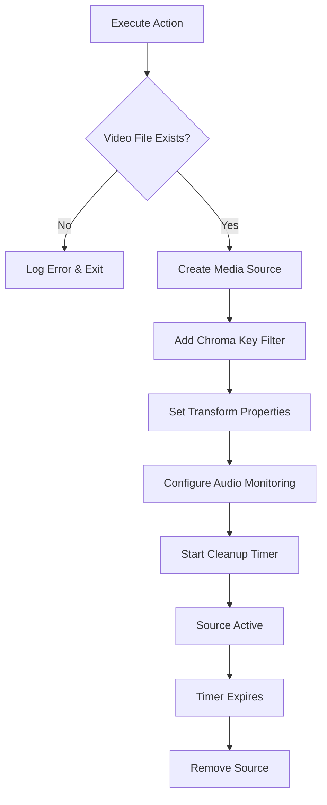

# Streamer.bot Temporary MediaSource Population

A Streamer.bot C# action that creates temporary video sources in OBS Studio with automatic chroma key filtering and cleanup. Perfect for overlay effects, alerts, or temporary media displays that need to appear for a specific duration.

## Features

- ✨ **Automatic Media Source Creation**: Dynamically creates OBS media sources from video files
- 🎨 **Chroma Key Support**: Built-in chroma key filtering with customizable settings
- ⏰ **Timed Cleanup**: Automatically removes sources after a specified duration
- 📐 **Flexible Positioning**: Customizable size and position for each source
- � **Optional Audio Monitoring**: Configurable audio output and monitoring
- �🔧 **Parameter Driven**: Highly configurable through Streamer.bot arguments
- 🎯 **Conflict Prevention**: Uses GUID-based naming to avoid source name conflicts
- 📝 **Comprehensive Logging**: Built-in logging for debugging and monitoring

## Requirements

### Software Dependencies
- **Streamer.bot** (Latest version recommended)
- **OBS Studio** with WebSocket plugin enabled
- **.NET Framework** (Streamer.bot compatible version)

### NuGet Packages
- `Newtonsoft.Json` - For JSON parsing and manipulation

## Installation

### Quick Setup (Simple)

1. Copy the C# code from `Execute C#` file
2. Create a new C# action in Streamer.bot
3. Paste the code into the action editor
4. Ensure Newtonsoft.Json is available in your Streamer.bot environment
5. Configure the action arguments (see Parameters section below)

### Full Setup (Recommended)

This method provides better organization and reusability by separating the code logic from parameter configuration.

#### Step 1: Create the Core C# Function

1. **Create New Action**
   - Right-click in Actions tab → "Add Action"
   - Name: `TempMediaSource_Core`
   - Trigger: **None** (No Trigger)

2. **Add C# Code Sub-Action**
   - Add Sub-Action → "Core" → "C#" → "Execute C# Code"
   - Paste the complete C# code from `Execute C#` file
   - **Important**: In Code Editor Settings, set **Name** field to: `TempMediaSourceFunction`
   - Click "Compile" to ensure no errors

#### Step 2: Create Parameter Configuration Actions

Create individual actions for each media type you want to use. Repeat this step for each different media source:

1. **Create Media-Specific Action**
   - Right-click in Actions tab → "Add Action"
   - Name: `TempMedia_FollowAlert` (or your preferred name)
   - Trigger: **None** (No Trigger)

2. **Configure Parameters**
   - Add Sub-Action → "Core" → "Variables" → "Set Argument"
   - Set each parameter (repeat for all needed parameters):
     ```
     BlinkVidPath: "D:\Alerts\follow-alert.mp4"
     BlinkTaskLength: 3
     BlinkWidth: 400
     BlinkHeight: 200
     BlinkPosX: 960
     BlinkPosY: 100
     BlinkChroma: 0x00FF00
     BlinkChromaSim: 400
     BlinkChromaSmooth: 80
     BlinkAudioMonitor: true
     ```

3. **Add Execute Code Sub-Action**
   - Add Sub-Action → "Core" → "C#" → "Execute C# Method"
   - In the dropdown, select: `TempMediaSourceFunction` (the named function from Step 1)
   - This should be the **last** sub-action in the list

4. **Repeat for Multiple Media Types**
   - `TempMedia_SubAlert`
   - `TempMedia_DonationAlert`
   - `TempMedia_HostAlert`
   - etc.

#### Step 3: Create Trigger Actions

Create the actions that will actually be triggered by events:

1. **Create Triggered Action**
   - Right-click in Actions tab → "Add Action"
   - Name: `OnFollow` (or your event name)
   - Trigger: **Set your desired trigger** (e.g., Twitch Follow, Channel Point Reward, etc.)

2. **Add Run Action Sub-Action**
   - Add Sub-Action → "Core" → "Actions" → "Run Action"
   - Select Action: `TempMedia_FollowAlert` (the parameter action from Step 2)

3. **Repeat for All Events**
   - Create `OnSubscription` → Run `TempMedia_SubAlert`
   - Create `OnDonation` → Run `TempMedia_DonationAlert`
   - Create `OnHost` → Run `TempMedia_HostAlert`
   - etc.

#### Benefits of Full Setup

- **Reusability**: One core function, multiple configurations
- **Organization**: Clear separation of logic and parameters
- **Maintainability**: Update code in one place, affects all media sources
- **Flexibility**: Easy to add new media types without duplicating code
- **Testing**: Can test individual parameter sets without triggers

## Parameters

Configure these arguments in your Streamer.bot action:

| Parameter | Type | Default | Description |
|-----------|------|---------|-------------|
| `BlinkVidPath` | String | `""` | **Required** - Full path to the video file |
| `BlinkTaskLength` | Integer | `10` | Duration in seconds before auto-removal |
| `BlinkChroma` | Integer/Hex | `0x00FF00` | Chroma key color (supports hex format) |
| `BlinkWidth` | Integer | `640` | Source width in pixels |
| `BlinkHeight` | Integer | `360` | Source height in pixels |
| `BlinkPosX` | Integer | `100` | X position on screen |
| `BlinkPosY` | Integer | `100` | Y position on screen |
| `BlinkChromaSim` | Integer | `400` | Chroma key similarity threshold |
| `BlinkChromaSmooth` | Integer | `80` | Chroma key smoothness value |
| `BlinkAudioMonitor` | Boolean | `false` | Enable audio monitoring and output |

### Parameter Examples

```
BlinkVidPath: "D:\Videos\alert.mp4"
BlinkTaskLength: 5
BlinkChroma: 0x00FF00  (or 65280 for green)
BlinkWidth: 1920
BlinkHeight: 1080
BlinkPosX: 0
BlinkPosY: 0
BlinkChromaSim: 300
BlinkChromaSmooth: 100
BlinkAudioMonitor: true
```

## Usage Examples

### Basic Alert Overlay
```
BlinkVidPath: "C:\Alerts\follow-alert.mp4"
BlinkTaskLength: 3
BlinkWidth: 400
BlinkHeight: 200
BlinkPosX: 960
BlinkPosY: 100
BlinkAudioMonitor: false
```

### Green Screen Effect with Audio
```
BlinkVidPath: "D:\Effects\explosion.mp4"
BlinkChroma: 0x00FF00
BlinkChromaSim: 400
BlinkChromaSmooth: 80
BlinkTaskLength: 8
BlinkAudioMonitor: true
```

### Full Screen Temporary Overlay
```
BlinkVidPath: "E:\Overlays\transition.mp4"
BlinkWidth: 1920
BlinkHeight: 1080
BlinkPosX: 0
BlinkPosY: 0
BlinkTaskLength: 2
BlinkAudioMonitor: false
```

## How It Works

1. **Validation**: Checks if the specified video file exists
2. **Source Creation**: Creates a new FFmpeg source in the current OBS scene
3. **Filter Application**: Adds and configures chroma key filtering
4. **Audio Setup**: Conditionally configures audio monitoring (if enabled)
5. **Transform Setup**: Sets position and size properties
6. **Async Cleanup**: Starts a timer to automatically remove the source

### Technical Flow



## Code Structure

### `CPHInline` Class
- Main entry point for Streamer.bot
- Handles parameter parsing and validation
- Manages the `ObsMediaTask` lifecycle

### `ObsMediaTask` Class
- Encapsulates all OBS operations
- Manages source creation, configuration, and cleanup
- Handles asynchronous timing operations

### Key Methods
- `TryGetArg<T>()`: Safe parameter extraction with type conversion
- `AddSource()`: Creates the media source in OBS
- `AddFilter()`: Applies chroma key filtering
- `SetTransform()`: Configures size and position
- `Start()`: Begins the timed cleanup process

## Troubleshooting

### Common Issues

**File Not Found Error**
```
Solution: Verify the file path exists and is accessible
Check: File permissions and network drive availability
```

**Source Not Appearing**
```
Solution: Check OBS WebSocket connection
Verify: Current scene name and source creation logs
```

**Chroma Key Not Working**
```
Solution: Adjust similarity and smoothness values
Try: Different chroma key color values
```

**Performance Issues**
```
Solution: Reduce video resolution or bitrate
Consider: Shorter task lengths for frequent use
```

### Debug Logging

The script provides comprehensive logging:
- Source creation confirmation
- Task duration tracking
- Error reporting for failed operations
- Cleanup completion notifications

## Advanced Configuration

### Custom Chroma Colors
```csharp
// Green screen
BlinkChroma: 0x00FF00

// Blue screen  
BlinkChroma: 0x0000FF

// Magenta
BlinkChroma: 0xFF00FF
```

### Multiple Simultaneous Sources
The GUID-based naming system allows multiple instances to run simultaneously without conflicts. Each source gets a unique 6-character identifier.

## Contributing

This project is designed for Streamer.bot automation. Feel free to:
- Report issues or bugs
- Suggest feature improvements
- Share usage examples
- Contribute optimizations

## Support the Developer

This project was created by **ArnieTW**! If you find this tool useful for your streaming setup, consider showing your support:

🎮 **Follow on Twitch**: [twitch.tv/arnietw](https://twitch.tv/arnietw)  
☕ **Buy me a coffee**: [ko-fi.com/arnietw](https://ko-fi.com/arnietw)

Your follows and support help create more awesome tools for the streaming community! 💜

## License

This code is provided as-is for use with Streamer.bot. Modify and distribute according to your needs.

## Version History

- **v1.0**: Initial implementation with basic media source management
- Current: Full chroma key support, audio monitoring, and robust error handling

---

*For Streamer.bot support and community resources, visit the official Streamer.bot Discord server.*